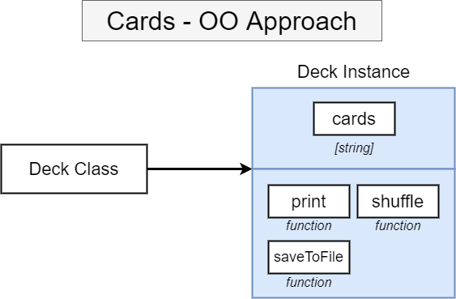
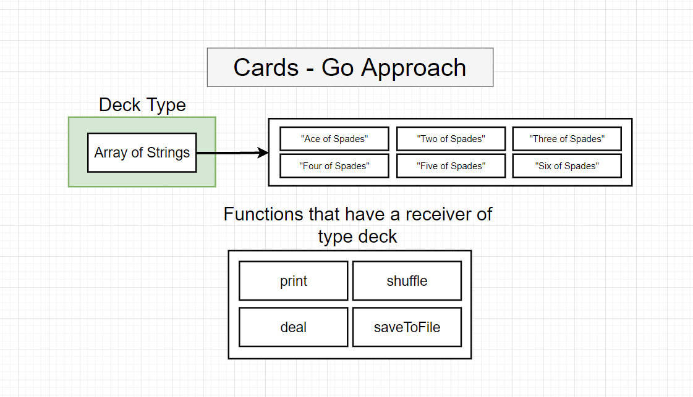
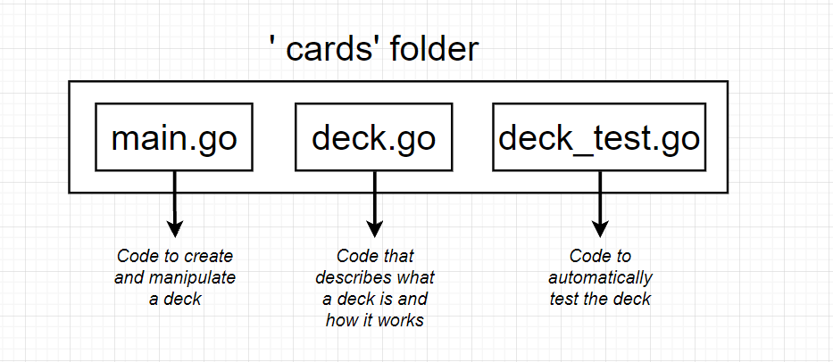
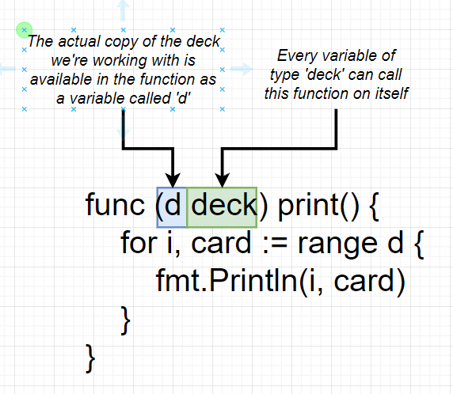

# Go

A repo containing all about the GO during my learnings

Hope this makes go language easy to learn.  😃😃


###  [GO OFFICIAL WEBSITE](https://golang.org/)

### My environment Setup

1. VSCODE
2. GO official vscode extension
3. A windows 10 OS😁😁


# Basics

Lets start with the most basic hello world program

`hello.go`

```go
package main

import "fmt"

func main() {
	fmt.Printf("Hello world")
}
```

Make sure to use double quotes and not single quotes

Now some of the questions that may come in our mind after seeing the program are:-

1. **How do we run the project?**
   
   - Go to the program directory and run `go run hello.go`

    - Make sure to install the go compiler from the official website mentioned above.

    ### GO CLI Commands

    1. `go build` - compiles a bunch of source code files (it does not execute it but just create a binary eg. for windows it will be an exe file)
    2. `go run` - compiles or ececutes one or more files
    3. `go fmt` - formats all the code in each file in the current directory
    4. `go install` - compiles and install a package
    5. `go get` - download the raw code of someone else package
    6. `go test` - run any test associated with the current project

<br/>

2. **What does `package main` means?**

    - Package is like workspace of common source code file for a project 

    - package == project ==workspace

    - every file of same package must contain same name package

    - Now there are two types of package `executable` and `reusable`
    - `Executable` generates a file that we can run
    - `reusable` is used as "helpers".It is good place to put reusable logic
    - creating final binary using build works only for `executable` type package
    - So to know if we are making executable package we need to specify `main` as package name
    - If we use any other package name other than main and then run ` go build filename` then it wont spit out the executable file or the binary
    - Everytime we make an executable package it should have a **functioon**(func) called **`main`**


3. **What does `import "fmt"` means?**

    - The import statement is used to get all code inside some other package
    - here `fmt` is used for format library usually for console output and debug purpose
    - there are other packages like **crypto, io , debug , math ,ecoding** etc
    - `fmt` is a standard library package
    - we can find the list of all standard package in this link [standard packages link](https://pkg.go.dev/std)

4. **What is the `func()`?**

    - func refers to functions similar to other programming language
    - `func main(){}`
    - `func` tells we are about to declare a function
    - `main` sets the name of the function
    - `()` - here we can pass the list of arguments to the functioon
    - `{}` -> function body

5. **How is the `hello.go` file organized?**

    - `package main` -> package declaration
    - `import "fmt"` -> import other packages that we need
    - `func main(){...}` -> declare fnctions 
    - This is the same pattern used in every go file 


# Our First Project - Deck Of Playing Cards

Here in this program we simulate the deck of playing cards
Using this we will be learning the basics of this language

**Features**:- 

1. newDeck -> create a list of playing cards essentially an array of strings
2. print -> log out the contents of a deck of cards
3. shuffle -> shuffle all the cards in a deck
4. deal -> create a hand of cards
5. saveToFile -> save list of cards to a file in local machine
6. newDeckFromFile -> load a list of cards from the local machine 

Create a new project directory

## Declaring a variable 

Go is a static typed language

```go
package main

import "fmt"

func main() {
	var card string = "Ace of Spades"
	fmt.Println(card)
}
```

- `var` tells that its variable 
- `card` tells the name of the variable
- `string` tells that only string will be stored in this variable

    ## Basic Data Types in GO

    1. bool
    2. string
    3. int
    4. float64

we can also use `card:= "Ace of Cards"` here the compiler get to know about the type of variable being stored

This syntax is used only while first initializing

```go
package main

import "fmt"

func main() {
	//var card string = "Ace of Spades"
	card := "Ace of spades"
	fmt.Println(card)
}
```

Note :-  Variables can be initialized outside of a function, but cannot be assigned a variable.


## Functions and return Types

```go
package main

import "fmt"

func main() {
	//var card string = "Ace of Spades"
	card := newCard()
	fmt.Println(card)
}

func newCard() string {
	return "Five of Diamonds"
}

```

Here  `newCard() string` tells that it will return string type of data

This return type can be anything with whatever we are returning

Note:- **Files in the same package can freely call functions defined in other files.**

- main.go

```go
package main
 
func main() {
    printState()
}
```
- state.go

```go
package main
 
import "fmt"
 
func printState() {
    fmt.Println("California")
}
```

Running both the files using `go run main.go state.go` will perfectly run

if we run only main.go then it would give error as `undefined: printState`


## Array and Slice


Now this `newCard` function will return more than one card so we need array

Array :- Fixed length of things
SLice :- An Array that can grow or shring


These both should be defined with some data type so that we can store same type of data in this.

slice

```go
package main

import "fmt"

func main() {

	//slice
	card := []string{"Ace of diamonds", newCard()}
	fmt.Println(card)
}

func newCard() string {
	return "Five of Diamonds"
}
```

Now we want to insert something in the slice so we use append

```go

	cards = append(cards, "Six of Spades")
```
Here append just returns new slice which


Now to iterate and print the cards we use

```go
//iterating over the slice to print elements of it
	for i, card := range cards {
		fmt.Println(i, card)
	}
```

```go
package main

import "fmt"

func main() {

	//slice
	cards := []string{"Ace of diamonds", newCard()}
	cards = append(cards, "Six of Spades")

	//iterating over the slice to print elements of it
	for i, card := range cards {
		fmt.Println(i, card)
	}
	fmt.Println(cards)
}

func newCard() string {
	return "Five of Diamonds"
}
```

here for iterating we are using for 

index = index of this element in the array

card = current card

range cards = Take the slice of cards and loop over it
 
we are using `:=` because everytime we are iterating we are getting new variables of i and card and we know this syntax is only used when we first initialize the variable in go


Note:- This will not work below code

```go
for index, card := range cards {
		fmt.Println(card)
	}
```

here we will get error as `index declared but not used`

## Object oriented approach in GO

Note:- Go is not an OO language
Here there is no idea of classes







Now we want to create a deck type 

deck.go
```go
package main

// create a new type of deck
//which is a slice of string
type deck []string

//this says it is equal to strings
```

main.go
```go
package main

import "fmt"

func main() {

	//slice
	cards := deck{"Ace of diamonds", newCard()}
	cards = append(cards, "Six of Spades")

	//iterating over the slice to print elements of it
	for i, card := range cards {
		fmt.Println(i, card)
	}

	fmt.Println(cards)
}

func newCard() string {
	return "Five of Diamonds"
}

```


Now we add our own reciever function

```go
package main

import "fmt"

// create a new type of deck
//which is a slice of string
type deck []string

//this says it is equal to strings

func (d deck) print() {
	for i, card := range d {
		fmt.Println(i, card)
	}
}
```

main.go

```go
package main

import "fmt"

func main() {

	//slice
	cards := deck{"Ace of diamonds", newCard()}
	cards = append(cards, "Six of Spades")

	cards.print()

	fmt.Println(cards)
}

func newCard() string {
	return "Five of Diamonds"
}
```

`func (d deck) print()` - this is a reciever functions which tells any veriable of type deck can access to the print method

Here d is the actual copy of the deck we are working with is available in the function as a variable called 'd'

deck -> every variable of type deck can call this function on itself




- By shaksham
- 2021